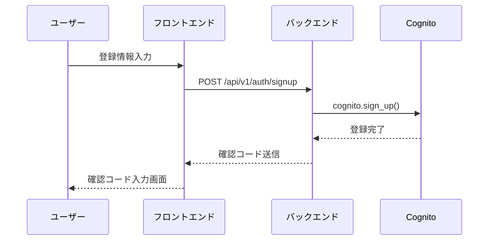
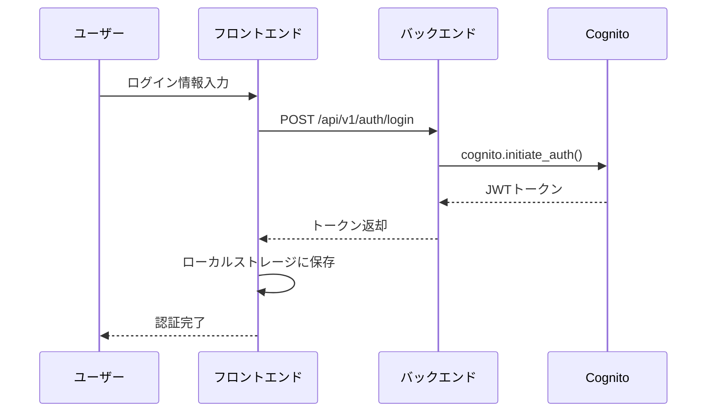
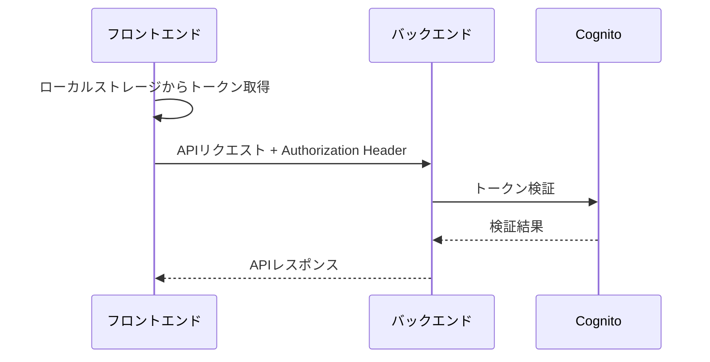

# 認証システム ドキュメント

## 目次
1. [現在の認証方式](#現在の認証方式)
2. [AWS Cognito設定](#aws-cognito設定)
3. [JWT認証フロー](#jwt認証フロー)
4. [ローカルストレージの使用](#ローカルストレージの使用)
5. [認証方式の比較](#認証方式の比較)
6. [セキュリティ考慮事項](#セキュリティ考慮事項)
7. [改善提案](#改善提案)

## 現在の認証方式

### 概要
本システムは**JWT（JSON Web Token）ベースの認証**を採用し、AWS Cognito User Poolを認証プロバイダーとして使用しています。

### 技術スタック
- **認証プロバイダー**: AWS Cognito User Pool
- **トークン形式**: JWT (JSON Web Token)
- **トークン保存**: ブラウザのローカルストレージ
- **フロントエンド**: Next.js + React Context
- **バックエンド**: FastAPI + Python

## AWS Cognito設定

### User Pool設定
```json
{
  "UserPoolId": "us-east-1_xxxxxxxxx",
  "ClientId": "xxxxxxxxxxxxxxxxxxxxxxxxxx",
  "Region": "us-east-1",
  "AuthenticationFlow": "USER_PASSWORD_AUTH"
}
```

### 認証フロー
- **USER_PASSWORD_AUTH**: ユーザー名/パスワードによる直接認証
- **SRP_AUTH**: Secure Remote Password (推奨だが未実装)

### トークン設定
```json
{
  "AccessTokenValidity": 3600,  // 1時間
  "IdTokenValidity": 3600,      // 1時間
  "RefreshTokenValidity": 30    // 30日
}
```

## JWT認証フロー

### 1. ユーザー登録フロー


### 2. ログインフロー


### 3. APIリクエストフロー


## ローカルストレージの使用

### トークン保存形式
```typescript
interface AuthTokens {
  accessToken: string;   // APIアクセス用
  idToken: string;       // ユーザー情報取得用
  refreshToken: string;  // トークン更新用（未使用）
}

// ローカルストレージへの保存
localStorage.setItem('auth_tokens', JSON.stringify(tokens));
```

### トークン取得・検証
```typescript
// トークン取得
const tokens = JSON.parse(localStorage.getItem('auth_tokens') || '{}');

// 有効期限チェック
const isTokenExpired = (token: string): boolean => {
  try {
    const payload = JSON.parse(atob(token.split('.')[1]));
    const currentTime = Math.floor(Date.now() / 1000);
    return payload.exp < currentTime;
  } catch {
    return true;
  }
};
```

### 認証状態管理
```typescript
// React Context使用
const AuthContext = createContext<AuthContextType | undefined>(undefined);

// 認証状態の復元
useEffect(() => {
  const tokens = localStorage.getItem('auth_tokens');
  if (tokens && !isTokenExpired(JSON.parse(tokens).idToken)) {
    // 認証状態を復元
    dispatch({ type: 'AUTH_SUCCESS', payload: { user, tokens } });
  }
}, []);
```

## 認証方式の比較

### 1. JWT vs Session-based

| 項目 | JWT | Session-based |
|------|-----|---------------|
| **スケーラビリティ** | ✅ 高い（ステートレス） | ❌ 低い（サーバー側セッション管理） |
| **セキュリティ** | ⚠️ 中程度（トークン漏洩リスク） | ✅ 高い（サーバー側管理） |
| **実装複雑度** | ✅ 簡単 | ⚠️ 中程度 |
| **ネットワーク効率** | ✅ 高い（トークン内蔵） | ❌ 低い（セッション確認） |
| **ログアウト** | ❌ 困難（トークン無効化） | ✅ 簡単（セッション削除） |

### 2. ローカルストレージ vs HttpOnly Cookie

| 項目 | ローカルストレージ | HttpOnly Cookie |
|------|-------------------|-----------------|
| **XSS攻撃** | ❌ 脆弱（JavaScriptアクセス可能） | ✅ 安全（JavaScriptアクセス不可） |
| **CSRF攻撃** | ✅ 安全 | ❌ 脆弱（SameSite設定必要） |
| **実装** | ✅ 簡単 | ⚠️ 中程度 |
| **トークン更新** | ✅ 簡単 | ⚠️ 複雑 |
| **モバイル対応** | ✅ 良好 | ⚠️ 制限あり |

### 3. OAuth 2.0 / OpenID Connect

| 項目 | 現在の方式 | OAuth 2.0 / OIDC |
|------|------------|------------------|
| **標準準拠** | ❌ 独自実装 | ✅ 業界標準 |
| **セキュリティ** | ⚠️ 中程度 | ✅ 高い（PKCE等） |
| **拡張性** | ❌ 限定的 | ✅ 高い（他プロバイダー連携） |
| **実装複雑度** | ✅ 簡単 | ⚠️ 複雑 |
| **ユーザー体験** | ✅ 良好 | ✅ 良好 |

## セキュリティ考慮事項

### 現在のリスク

#### 1. XSS攻撃
```javascript
// 悪意のあるスクリプトがトークンを盗む可能性
const token = localStorage.getItem('auth_tokens');
// 外部サーバーに送信...
```

#### 2. トークン漏洩
- ブラウザ開発者ツールでトークンが見える
- ローカルストレージは永続化される

#### 3. トークン無効化の困難
- ログアウト後もトークンが有効
- サーバー側でトークンを無効化できない

### セキュリティ対策

#### 1. 現在実装済み
- JWTトークンの有効期限チェック
- 期限切れトークンの自動削除
- HTTPS通信の強制

#### 2. 推奨改善
- HttpOnly Cookieへの移行
- CSRF保護の実装
- セキュリティヘッダーの追加

## 改善提案

### 短期改善（1-2週間）

#### 1. HttpOnly Cookie移行
```python
# バックエンド
@app.post("/auth/login")
async def login(response: Response, ...):
    response.set_cookie(
        key="access_token",
        value=access_token,
        httponly=True,
        secure=True,
        samesite="strict",
        max_age=3600
    )
```

#### 2. CSRF保護
```typescript
// フロントエンド
const csrfToken = document.querySelector('meta[name="csrf-token"]').content;
fetch('/api/endpoint', {
  headers: { 'X-CSRF-Token': csrfToken }
});
```

### 中期改善（1-2ヶ月）

#### 1. OAuth 2.0 / OpenID Connect実装
```typescript
// Authorization Code Flow
const initiateOAuthLogin = () => {
  const params = new URLSearchParams({
    response_type: 'code',
    client_id: COGNITO_CLIENT_ID,
    redirect_uri: window.location.origin + '/auth/callback',
    scope: 'openid email profile',
    state: generateRandomState()
  });
  
  window.location.href = `https://${COGNITO_DOMAIN}/oauth2/authorize?${params}`;
};
```

#### 2. Refresh Token実装
```typescript
// 自動トークン更新
const refreshToken = async () => {
  const response = await fetch('/auth/refresh', {
    method: 'POST',
    credentials: 'include'
  });
  return response.json();
};
```

### 長期改善（3-6ヶ月）

#### 1. 多要素認証（MFA）
- SMS認証
- TOTP認証
- ハードウェアキー

#### 2. セキュリティ監視
- 異常ログイン検知
- トークン使用パターン分析
- セキュリティイベントログ

## 実装例

### 現在の認証コンテキスト
```typescript
// AuthContext.tsx
export function AuthProvider({ children }: AuthProviderProps) {
  const [state, dispatch] = useReducer(authReducer, initialState);

  // トークン有効期限チェック
  const isTokenExpired = (token: string): boolean => {
    try {
      const payload = JSON.parse(atob(token.split('.')[1]));
      const currentTime = Math.floor(Date.now() / 1000);
      return payload.exp < currentTime;
    } catch {
      return true;
    }
  };

  // 認証状態の初期化
  useEffect(() => {
    const initializeAuth = async () => {
      const tokens = localStorage.getItem('auth_tokens');
      if (tokens && !isTokenExpired(JSON.parse(tokens).idToken)) {
        // 認証状態を復元
        dispatch({ type: 'AUTH_SUCCESS', payload: { user, tokens } });
      }
    };
    initializeAuth();
  }, []);
}
```

### 推奨するOAuth 2.0実装
```typescript
// OAuth認証フロー
const useOAuth = () => {
  const initiateLogin = () => {
    const codeVerifier = generateCodeVerifier();
    const codeChallenge = generateCodeChallenge(codeVerifier);
    
    sessionStorage.setItem('code_verifier', codeVerifier);
    
    const params = new URLSearchParams({
      response_type: 'code',
      client_id: COGNITO_CLIENT_ID,
      redirect_uri: window.location.origin + '/auth/callback',
      scope: 'openid email profile',
      state: generateRandomState(),
      code_challenge: codeChallenge,
      code_challenge_method: 'S256'
    });
    
    window.location.href = `https://${COGNITO_DOMAIN}/oauth2/authorize?${params}`;
  };

  return { initiateLogin };
};
```

## まとめ

現在のJWT認証システムは開発段階では適切ですが、本番環境では以下の改善が推奨されます：

1. **短期**: HttpOnly Cookie + CSRF保護
2. **中期**: OAuth 2.0 / OpenID Connect実装
3. **長期**: 多要素認証 + セキュリティ監視

これらの改善により、セキュリティを大幅に向上させることができます。


