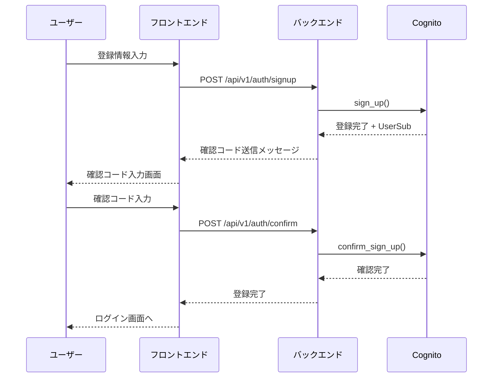
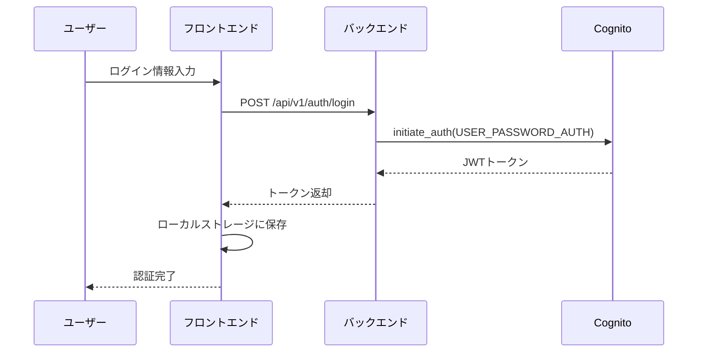
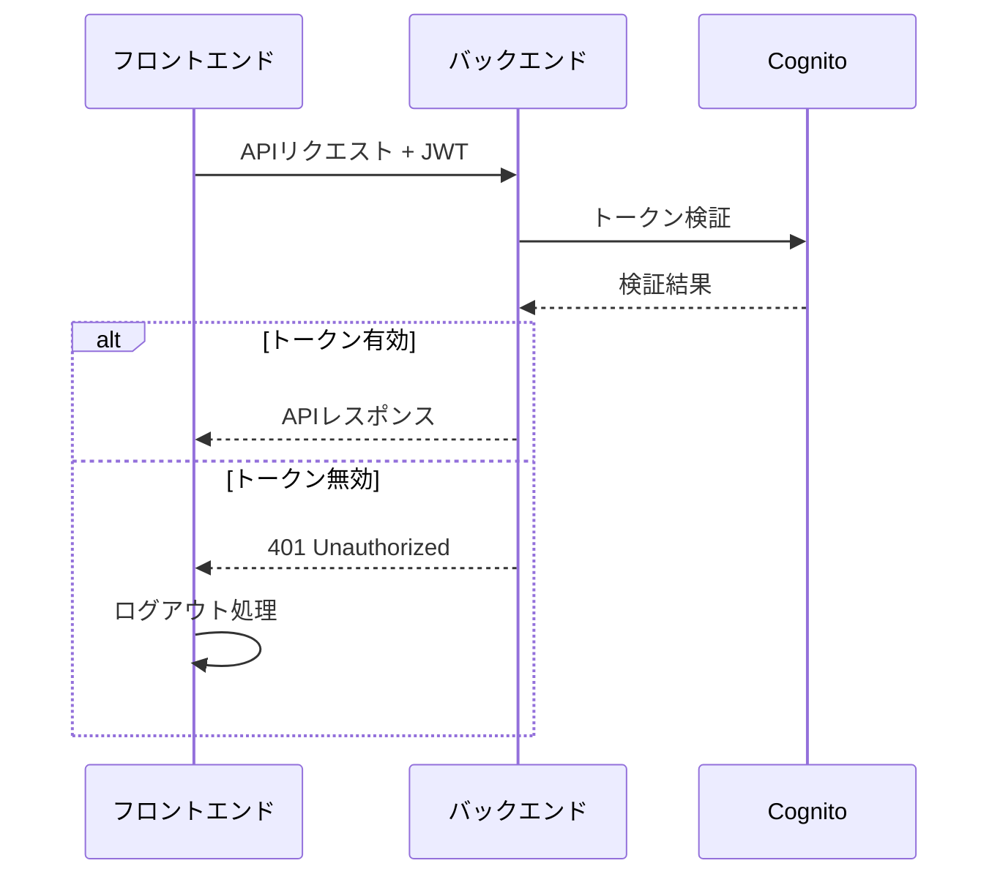

# AWS Cognito 統合ガイド

## 目次
1. [AWS Cognito概要](#aws-cognito概要)
2. [現在の実装](#現在の実装)
3. [Cognito設定](#cognito設定)
4. [認証フロー詳細](#認証フロー詳細)
5. [OAuth 2.0 / OpenID Connect対応](#oauth-20--openid-connect対応)
6. [セキュリティ設定](#セキュリティ設定)
7. [トラブルシューティング](#トラブルシューティング)

## AWS Cognito概要

### Cognitoとは
AWS Cognitoは、ユーザー認証、認可、ユーザー管理を提供するマネージドサービスです。OAuth 2.0、OpenID Connect、SAML 2.0などの業界標準プロトコルをサポートしています。

### 主要コンポーネント
- **User Pool**: ユーザーディレクトリと認証機能
- **Identity Pool**: AWSリソースへのアクセス認可
- **App Client**: アプリケーション固有の設定

## 現在の実装

### バックエンド実装
```python
# device-backend/app/auth/endpoints.py
import boto3
from botocore.exceptions import ClientError

# Cognitoクライアント初期化
cognito_client = boto3.client('cognito-idp', region_name='us-east-1')

# ユーザー登録
@app.post("/api/v1/auth/signup")
async def signup(request: SignUpRequest):
    try:
        response = cognito_client.sign_up(
            ClientId=COGNITO_CLIENT_ID,
            Username=request.email,
            Password=request.password,
            UserAttributes=[
                {'Name': 'email', 'Value': request.email},
                {'Name': 'given_name', 'Value': request.first_name},
                {'Name': 'family_name', 'Value': request.last_name}
            ]
        )
        return {"message": "登録完了", "user_sub": response['UserSub']}
    except ClientError as e:
        raise HTTPException(status_code=400, detail=str(e))

# ログイン
@app.post("/api/v1/auth/login")
async def login(request: LoginRequest):
    try:
        response = cognito_client.initiate_auth(
            ClientId=COGNITO_CLIENT_ID,
            AuthFlow='USER_PASSWORD_AUTH',
            AuthParameters={
                'USERNAME': request.email,
                'PASSWORD': request.password
            }
        )
        
        tokens = response['AuthenticationResult']
        return {
            "access_token": tokens['AccessToken'],
            "id_token": tokens['IdToken'],
            "refresh_token": tokens['RefreshToken']
        }
    except ClientError as e:
        raise HTTPException(status_code=401, detail="認証に失敗しました")
```

### フロントエンド実装
```typescript
// device-registry-frontend/src/lib/auth-api.ts
export class AuthApiClient {
  private baseUrl: string;

  constructor() {
    this.baseUrl = process.env.NEXT_PUBLIC_API_URL || 'http://localhost:8003';
  }

  async signUp(request: SignUpRequest): Promise<void> {
    const response = await this.request('/api/v1/auth/signup', {
      method: 'POST',
      body: JSON.stringify(request)
    });
    return response;
  }

  async login(request: LoginRequest): Promise<LoginResponse> {
    const response = await this.request('/api/v1/auth/login', {
      method: 'POST',
      body: JSON.stringify(request)
    });
    return response;
  }

  private async request<T>(endpoint: string, options: RequestInit): Promise<T> {
    const url = `${this.baseUrl}${endpoint}`;
    const response = await fetch(url, {
      headers: {
        'Content-Type': 'application/json',
        ...options.headers,
      },
      ...options,
    });

    if (!response.ok) {
      const errorData = await response.json().catch(() => ({}));
      throw new AuthApiError(
        errorData.detail || '認証エラーが発生しました',
        response.status
      );
    }

    return response.json();
  }
}
```

## Cognito設定

### User Pool設定
```json
{
  "UserPoolId": "us-east-1_xxxxxxxxx",
  "Name": "DeviceRegistryUserPool",
  "Policies": {
    "PasswordPolicy": {
      "MinimumLength": 8,
      "RequireUppercase": true,
      "RequireLowercase": true,
      "RequireNumbers": true,
      "RequireSymbols": true
    }
  },
  "Schema": [
    {
      "Name": "email",
      "AttributeDataType": "String",
      "Required": true,
      "Mutable": true
    },
    {
      "Name": "given_name",
      "AttributeDataType": "String",
      "Required": true,
      "Mutable": true
    },
    {
      "Name": "family_name",
      "AttributeDataType": "String",
      "Required": true,
      "Mutable": true
    }
  ]
}
```

### App Client設定
```json
{
  "ClientId": "xxxxxxxxxxxxxxxxxxxxxxxxxx",
  "ClientName": "DeviceRegistryApp",
  "GenerateSecret": false,
  "RefreshTokenValidity": 30,
  "AccessTokenValidity": 1,
  "IdTokenValidity": 1,
  "TokenValidityUnits": {
    "AccessToken": "hours",
    "IdToken": "hours",
    "RefreshToken": "days"
  },
  "ExplicitAuthFlows": [
    "ALLOW_USER_PASSWORD_AUTH",
    "ALLOW_REFRESH_TOKEN_AUTH"
  ]
}
```

### 環境変数設定
```bash
# .env
COGNITO_USER_POOL_ID=us-east-1_xxxxxxxxx
COGNITO_CLIENT_ID=xxxxxxxxxxxxxxxxxxxxxxxxxx
COGNITO_REGION=us-east-1
COGNITO_DOMAIN=your-domain.auth.us-east-1.amazoncognito.com
```

## 認証フロー詳細

### 1. ユーザー登録フロー


### 2. ログインフロー


### 3. トークン検証フロー


## OAuth 2.0 / OpenID Connect対応

### Cognito OAuth 2.0設定
```json
{
  "AllowedOAuthFlows": ["authorization_code"],
  "AllowedOAuthScopes": ["openid", "email", "profile"],
  "AllowedOAuthFlowsUserPoolClient": true,
  "CallbackURLs": [
    "http://localhost:3000/auth/callback",
    "https://yourdomain.com/auth/callback"
  ],
  "LogoutURLs": [
    "http://localhost:3000/auth/logout",
    "https://yourdomain.com/auth/logout"
  ]
}
```

### OAuth 2.0実装例
```typescript
// フロントエンド - OAuth認証開始
const initiateOAuthLogin = () => {
  const codeVerifier = generateCodeVerifier();
  const codeChallenge = generateCodeChallenge(codeVerifier);
  
  // PKCE用のcode_verifierを保存
  sessionStorage.setItem('code_verifier', codeVerifier);
  
  const params = new URLSearchParams({
    response_type: 'code',
    client_id: process.env.NEXT_PUBLIC_COGNITO_CLIENT_ID!,
    redirect_uri: window.location.origin + '/auth/callback',
    scope: 'openid email profile',
    state: generateRandomState(),
    code_challenge: codeChallenge,
    code_challenge_method: 'S256'
  });
  
  window.location.href = `https://${process.env.NEXT_PUBLIC_COGNITO_DOMAIN}/oauth2/authorize?${params}`;
};

// OAuth コールバック処理
const handleOAuthCallback = async () => {
  const urlParams = new URLSearchParams(window.location.search);
  const code = urlParams.get('code');
  const state = urlParams.get('state');
  const codeVerifier = sessionStorage.getItem('code_verifier');
  
  if (!code || !codeVerifier) {
    throw new Error('認証コードまたはcode_verifierが見つかりません');
  }
  
  // バックエンドでトークン交換
  const response = await fetch('/api/v1/auth/oauth/callback', {
    method: 'POST',
    headers: { 'Content-Type': 'application/json' },
    body: JSON.stringify({ code, code_verifier, state })
  });
  
  const tokens = await response.json();
  // トークンを安全に保存
  localStorage.setItem('auth_tokens', JSON.stringify(tokens));
};
```

### バックエンド - OAuth コールバック処理
```python
@app.post("/api/v1/auth/oauth/callback")
async def oauth_callback(request: OAuthCallbackRequest):
    try:
        # Authorization CodeをAccess Tokenに交換
        response = cognito_client.initiate_auth(
            ClientId=COGNITO_CLIENT_ID,
            AuthFlow='AUTHORIZATION_CODE',
            AuthParameters={
                'CODE': request.code,
                'REDIRECT_URI': request.redirect_uri,
                'CODE_VERIFIER': request.code_verifier
            }
        )
        
        tokens = response['AuthenticationResult']
        
        # ユーザー情報を取得
        user_info = cognito_client.get_user(
            AccessToken=tokens['AccessToken']
        )
        
        return {
            "access_token": tokens['AccessToken'],
            "id_token": tokens['IdToken'],
            "refresh_token": tokens.get('RefreshToken'),
            "user": {
                "sub": user_info['Username'],
                "email": get_user_attribute(user_info, 'email'),
                "given_name": get_user_attribute(user_info, 'given_name'),
                "family_name": get_user_attribute(user_info, 'family_name')
            }
        }
    except ClientError as e:
        raise HTTPException(status_code=400, detail=str(e))
```

## セキュリティ設定

### 1. パスワードポリシー
```json
{
  "PasswordPolicy": {
    "MinimumLength": 8,
    "RequireUppercase": true,
    "RequireLowercase": true,
    "RequireNumbers": true,
    "RequireSymbols": true,
    "TemporaryPasswordValidityDays": 7
  }
}
```

### 2. 多要素認証（MFA）
```python
# MFA設定
@app.post("/api/v1/auth/enable-mfa")
async def enable_mfa(access_token: str):
    try:
        # MFA設定の開始
        response = cognito_client.associate_software_token(
            AccessToken=access_token
        )
        
        return {
            "secret_code": response['SecretCode'],
            "qr_code": generate_qr_code(response['SecretCode'])
        }
    except ClientError as e:
        raise HTTPException(status_code=400, detail=str(e))

# MFA確認
@app.post("/api/v1/auth/verify-mfa")
async def verify_mfa(request: MFAVerifyRequest):
    try:
        response = cognito_client.verify_software_token(
            AccessToken=request.access_token,
            UserCode=request.user_code,
            FriendlyDeviceName=request.device_name
        )
        
        return {"status": "MFA enabled"}
    except ClientError as e:
        raise HTTPException(status_code=400, detail=str(e))
```

### 3. 異常検知
```python
# 異常ログイン検知
@app.middleware("http")
async def security_monitoring(request: Request, call_next):
    # IPアドレス、ユーザーエージェント等をログ
    client_ip = request.client.host
    user_agent = request.headers.get("user-agent")
    
    # 異常パターンの検知
    if is_suspicious_activity(client_ip, user_agent):
        # セキュリティアラート
        send_security_alert(client_ip, user_agent)
    
    return await call_next(request)
```

## トラブルシューティング

### よくある問題と解決方法

#### 1. 認証エラー
```python
# エラーハンドリング
try:
    response = cognito_client.initiate_auth(...)
except ClientError as e:
    error_code = e.response['Error']['Code']
    
    if error_code == 'NotAuthorizedException':
        # パスワードが間違っている
        raise HTTPException(status_code=401, detail="認証情報が正しくありません")
    elif error_code == 'UserNotFoundException':
        # ユーザーが存在しない
        raise HTTPException(status_code=404, detail="ユーザーが見つかりません")
    elif error_code == 'UserNotConfirmedException':
        # ユーザーが確認されていない
        raise HTTPException(status_code=400, detail="ユーザー確認が必要です")
    else:
        raise HTTPException(status_code=500, detail="認証エラーが発生しました")
```

#### 2. トークン検証エラー
```python
# JWT検証
import jwt
from jwt.exceptions import InvalidTokenError

def verify_jwt_token(token: str) -> dict:
    try:
        # Cognitoの公開鍵で検証
        payload = jwt.decode(
            token,
            cognito_public_key,
            algorithms=['RS256'],
            audience=COGNITO_CLIENT_ID,
            issuer=f"https://cognito-idp.{COGNITO_REGION}.amazonaws.com/{COGNITO_USER_POOL_ID}"
        )
        return payload
    except InvalidTokenError as e:
        raise HTTPException(status_code=401, detail="無効なトークンです")
```

#### 3. CORS問題
```python
# FastAPI CORS設定
from fastapi.middleware.cors import CORSMiddleware

app.add_middleware(
    CORSMiddleware,
    allow_origins=["http://localhost:3000", "https://yourdomain.com"],
    allow_credentials=True,
    allow_methods=["GET", "POST", "PUT", "DELETE"],
    allow_headers=["*"],
)
```

### デバッグ用ログ
```python
import logging

# 認証ログ
logging.basicConfig(level=logging.INFO)
logger = logging.getLogger(__name__)

@app.post("/api/v1/auth/login")
async def login(request: LoginRequest):
    logger.info(f"Login attempt for user: {request.email}")
    
    try:
        response = cognito_client.initiate_auth(...)
        logger.info(f"Login successful for user: {request.email}")
        return response
    except ClientError as e:
        logger.error(f"Login failed for user: {request.email}, error: {str(e)}")
        raise HTTPException(status_code=401, detail="認証に失敗しました")
```

## パフォーマンス最適化

### 1. トークンキャッシュ
```python
from functools import lru_cache

@lru_cache(maxsize=1000)
def get_cognito_public_key(key_id: str):
    # Cognitoの公開鍵をキャッシュ
    response = requests.get(f"https://cognito-idp.{COGNITO_REGION}.amazonaws.com/{COGNITO_USER_POOL_ID}/.well-known/jwks.json")
    jwks = response.json()
    
    for key in jwks['keys']:
        if key['kid'] == key_id:
            return jwt.algorithms.RSAAlgorithm.from_jwk(key)
    
    raise ValueError(f"Key {key_id} not found")
```

### 2. 接続プール
```python
import boto3
from botocore.config import Config

# 接続プール設定
config = Config(
    max_pool_connections=50,
    retries={'max_attempts': 3}
)

cognito_client = boto3.client(
    'cognito-idp',
    region_name=COGNITO_REGION,
    config=config
)
```

## まとめ

AWS Cognitoは強力な認証サービスですが、適切な設定と実装が必要です。現在の実装は基本的な機能を提供していますが、セキュリティとユーザー体験を向上させるために以下の改善を推奨します：

1. **OAuth 2.0 / OpenID Connect実装**
2. **多要素認証の追加**
3. **セキュリティ監視の実装**
4. **パフォーマンス最適化**

これらの改善により、エンタープライズレベルの認証システムを構築できます。


