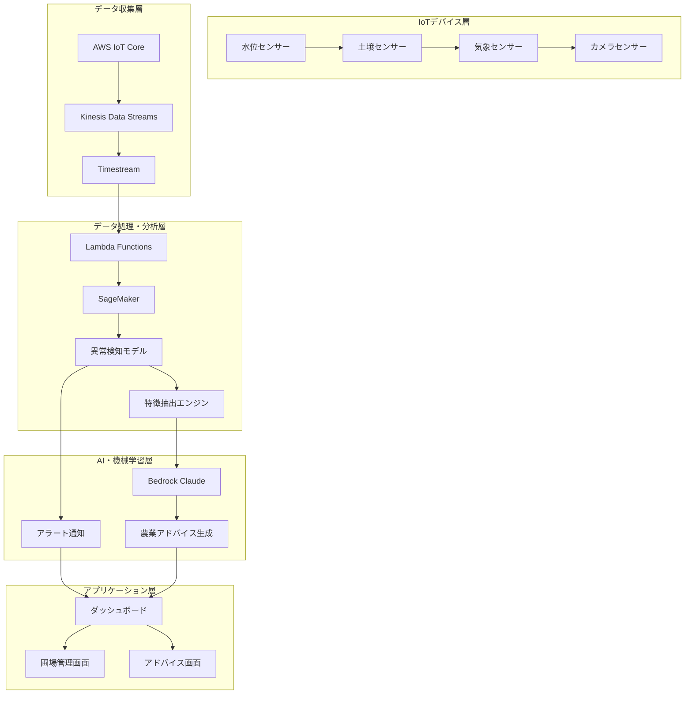
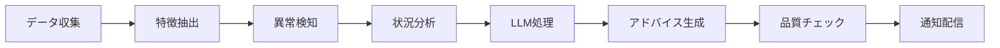

# 農業IoT AIシステム 将来展望ロードマップ

## 📋 概要

現在の水位監視システムを基盤として、機械学習による異常検知とLLMによる農業アドバイス機能を持つ包括的な農業IoT AIシステムへの発展を目指します。

## 🎯 最終目標

**圃場ごとの特徴を抽出 → 機械学習による異常検知 → LLMによる農業作業アドバイス**

## 🏗️ システム全体アーキテクチャ



## 📱 フロントエンド（Next.js）新機能

### 1. 圃場管理ページ
```
/dashboard/fields
├── 圃場一覧表示
├── 圃場詳細情報
├── 圃場別センサーデータ
├── 圃場別異常検知履歴
└── 圃場設定・編集
```

### 2. 異常検知・アラートページ
```
/dashboard/alerts
├── リアルタイムアラート一覧
├── 異常検知履歴
├── アラート設定
├── 通知履歴
└── 緊急対応ガイド
```

### 3. AI農業アドバイスページ
```
/dashboard/ai-advisor
├── 圃場別アドバイス表示
├── 作業スケジュール提案
├── 天気予報連携
├── 過去のアドバイス履歴
└── アドバイス評価・フィードバック
```

### 4. データ分析・可視化ページ
```
/dashboard/analytics
├── 圃場別データ分析
├── 異常パターン可視化
├── 予測グラフ
├── 比較分析
└── レポート生成
```

### 5. 設定・管理ページ
```
/dashboard/settings
├── 圃場設定
├── センサー設定
├── アラート設定
├── AIモデル設定
└── ユーザー管理
```

## 🔧 新機能コンポーネント

### 1. 圃場管理コンポーネント
```typescript
// components/FieldManagement.tsx
- FieldList: 圃場一覧表示
- FieldCard: 圃場カード表示
- FieldDetail: 圃場詳細情報
- FieldSettings: 圃場設定
- SensorStatus: センサー状態表示
```

### 2. 異常検知コンポーネント
```typescript
// components/AnomalyDetection.tsx
- AlertList: アラート一覧
- AlertCard: アラートカード
- AnomalyChart: 異常検知グラフ
- AlertSettings: アラート設定
- EmergencyGuide: 緊急対応ガイド
```

### 3. AIアドバイスコンポーネント
```typescript
// components/AIAdvisor.tsx
- AdvisorCard: アドバイスカード
- WorkSchedule: 作業スケジュール
- WeatherWidget: 天気予報
- AdviceHistory: アドバイス履歴
- FeedbackForm: フィードバック
```

### 4. データ可視化コンポーネント
```typescript
// components/DataVisualization.tsx
- TimeSeriesChart: 時系列グラフ
- AnomalyHeatmap: 異常ヒートマップ
- PredictionChart: 予測グラフ
- ComparisonChart: 比較グラフ
- ReportGenerator: レポート生成
```

## ☁️ AWS構成拡張

### 1. データ収集・ストレージ
```yaml
# 既存
- AWS IoT Core: デバイス接続
- Timestream: 時系列データ
- DynamoDB: デバイス・ユーザー管理

# 新規追加
- S3: 画像・ファイルストレージ
- Kinesis Data Streams: リアルタイムデータストリーミング
- RDS PostgreSQL: 圃場・作物情報管理
- ElastiCache: キャッシュ・セッション管理
```

### 2. 機械学習・AI
```yaml
# SageMaker
- SageMaker Studio: ML開発環境
- SageMaker Endpoints: モデル推論
- SageMaker Pipelines: MLパイプライン
- SageMaker Feature Store: 特徴量管理

# Bedrock
- Claude 3.5 Sonnet: 農業アドバイス生成
- Text Embeddings: 文書ベクトル化
- Knowledge Base: 農業知識ベース
```

### 3. データ処理・分析
```yaml
# Lambda Functions
- DataPreprocessing: データ前処理
- FeatureExtraction: 特徴抽出
- AnomalyDetection: 異常検知
- AlertNotification: アラート通知
- AIAdvisorGeneration: アドバイス生成

# ECS/Fargate
- MLTrainingJobs: モデル訓練
- DataProcessingJobs: バッチ処理
- ModelServing: モデル配信
```

### 4. 通知・連携
```yaml
# SNS/SES
- Email通知: アラート・アドバイス
- SMS通知: 緊急アラート
- Push通知: モバイルアプリ

# EventBridge
- イベント駆動処理
- スケジュール実行
- 外部システム連携
```

## 🤖 機械学習モデル設計

### 1. 異常検知モデル
```python
# モデル種類
- Isolation Forest: 異常値検出
- LSTM Autoencoder: 時系列異常検知
- Random Forest: 分類ベース異常検知
- One-Class SVM: 正常パターン学習

# 特徴量
- 水位データ（時系列）
- 土壌水分・温度
- 気象データ（気温・湿度・降水量）
- 画像データ（圃場状態）
- 季節・時間情報
```

### 2. 予測モデル
```python
# 予測対象
- 水位変化予測
- 作物成長予測
- 病害虫発生予測
- 収穫時期予測

# モデル手法
- Prophet: 時系列予測
- XGBoost: 回帰・分類
- CNN: 画像解析
- Transformer: 多変量時系列
```

### 3. 圃場特徴抽出
```python
# 特徴量エンジニアリング
- 統計的特徴量（平均・分散・歪度・尖度）
- 時系列特徴量（トレンド・周期性・変動性）
- 空間的特徴量（圃場位置・地形・土質）
- 環境特徴量（気候・土壌・水質）
- 作物特徴量（品種・成長段階・栽培履歴）
```

## 🧠 LLM農業アドバイスシステム

### 1. プロンプト設計
```python
# システムプロンプト
"""
あなたは経験豊富な農業専門家です。
以下の情報を基に、具体的で実用的な農業アドバイスを提供してください。

【圃場情報】
- 圃場ID: {field_id}
- 作物: {crop_type}
- 成長段階: {growth_stage}
- 土質: {soil_type}
- 気候: {climate_zone}

【現在の状況】
- 水位: {water_level}
- 土壌水分: {soil_moisture}
- 気温: {temperature}
- 湿度: {humidity}
- 異常検知結果: {anomaly_result}

【過去のデータ】
- 栽培履歴: {cultivation_history}
- 収穫実績: {harvest_records}
- 問題履歴: {problem_history}
"""
```

### 2. アドバイス生成フロー


### 3. アドバイス種類
```typescript
interface AgriculturalAdvice {
  type: 'irrigation' | 'fertilization' | 'pest_control' | 'harvest' | 'emergency';
  priority: 'low' | 'medium' | 'high' | 'urgent';
  title: string;
  description: string;
  steps: string[];
  timing: string;
  tools: string[];
  precautions: string[];
  expectedOutcome: string;
}
```

## 📊 データベース設計拡張

### 1. 圃場管理テーブル
```sql
-- 圃場情報
CREATE TABLE fields (
  field_id VARCHAR(50) PRIMARY KEY,
  user_id VARCHAR(50) NOT NULL,
  field_name VARCHAR(100) NOT NULL,
  crop_type VARCHAR(50),
  soil_type VARCHAR(50),
  area_hectares DECIMAL(10,2),
  location_lat DECIMAL(10,8),
  location_lon DECIMAL(11,8),
  climate_zone VARCHAR(50),
  created_at TIMESTAMP,
  updated_at TIMESTAMP
);

-- センサー配置
CREATE TABLE field_sensors (
  sensor_id VARCHAR(50) PRIMARY KEY,
  field_id VARCHAR(50) NOT NULL,
  sensor_type VARCHAR(50) NOT NULL,
  position_lat DECIMAL(10,8),
  position_lon DECIMAL(11,8),
  installation_date DATE,
  status VARCHAR(20)
);
```

### 2. 異常検知テーブル
```sql
-- 異常検知結果
CREATE TABLE anomaly_detections (
  detection_id VARCHAR(50) PRIMARY KEY,
  field_id VARCHAR(50) NOT NULL,
  sensor_id VARCHAR(50) NOT NULL,
  anomaly_type VARCHAR(50) NOT NULL,
  severity VARCHAR(20) NOT NULL,
  confidence_score DECIMAL(5,4),
  detected_at TIMESTAMP,
  resolved_at TIMESTAMP,
  description TEXT
);

-- アラート履歴
CREATE TABLE alert_history (
  alert_id VARCHAR(50) PRIMARY KEY,
  detection_id VARCHAR(50) NOT NULL,
  user_id VARCHAR(50) NOT NULL,
  alert_type VARCHAR(50) NOT NULL,
  message TEXT NOT NULL,
  sent_at TIMESTAMP,
  read_at TIMESTAMP,
  action_taken TEXT
);
```

### 3. AIアドバイステーブル
```sql
-- 農業アドバイス
CREATE TABLE agricultural_advice (
  advice_id VARCHAR(50) PRIMARY KEY,
  field_id VARCHAR(50) NOT NULL,
  user_id VARCHAR(50) NOT NULL,
  advice_type VARCHAR(50) NOT NULL,
  priority VARCHAR(20) NOT NULL,
  title VARCHAR(200) NOT NULL,
  description TEXT NOT NULL,
  steps JSON,
  timing VARCHAR(100),
  tools JSON,
  precautions TEXT,
  expected_outcome TEXT,
  generated_at TIMESTAMP,
  implemented_at TIMESTAMP,
  feedback_rating INTEGER,
  feedback_comment TEXT
);
```

## 🔄 実装フェーズ

### Phase 1: 基盤拡張（3ヶ月）
- [ ] 圃場管理機能の実装
- [ ] 追加センサー対応
- [ ] データベース設計・実装
- [ ] 基本的な異常検知アルゴリズム

### Phase 2: 機械学習導入（6ヶ月）
- [ ] SageMaker環境構築
- [ ] 異常検知モデル開発
- [ ] 特徴抽出エンジン実装
- [ ] リアルタイム推論システム

### Phase 3: LLM統合（3ヶ月）
- [ ] Bedrock統合
- [ ] 農業アドバイス生成システム
- [ ] 通知システム実装
- [ ] フィードバック機能

### Phase 4: 高度化・最適化（継続）
- [ ] モデル精度向上
- [ ] ユーザビリティ改善
- [ ] パフォーマンス最適化
- [ ] 新機能追加

## 📈 期待される効果

### 1. 農業生産性向上
- 異常の早期発見・対応
- 最適なタイミングでの作業指示
- データドリブンな意思決定

### 2. リスク軽減
- 病害虫・異常気象の予測
- 緊急事態の迅速な対応
- 収穫量の安定化

### 3. 知識の蓄積・共有
- 圃場別の最適化パターン学習
- 農業ノウハウのデジタル化
- ベストプラクティスの共有

## 🛠️ 技術スタック

### フロントエンド
- **Next.js 14**: React フレームワーク
- **TypeScript**: 型安全性
- **Tailwind CSS**: スタイリング
- **Chart.js/D3.js**: データ可視化
- **React Query**: データフェッチング

### バックエンド
- **FastAPI**: API サーバー
- **Python**: 機械学習・データ処理
- **Celery**: 非同期タスク処理
- **Redis**: キャッシュ・キュー

### 機械学習
- **scikit-learn**: 基本的なML
- **TensorFlow/PyTorch**: 深層学習
- **Prophet**: 時系列予測
- **MLflow**: 実験管理

### AWS サービス
- **SageMaker**: 機械学習プラットフォーム
- **Bedrock**: LLM サービス
- **Lambda**: サーバーレス処理
- **EventBridge**: イベント駆動
- **SNS/SES**: 通知サービス

## 🎯 成功指標（KPI）

### 技術指標
- 異常検知精度: >95%
- アドバイス実装率: >80%
- システム稼働率: >99.9%
- レスポンス時間: <2秒

### ビジネス指標
- 収穫量向上: +15%
- 作業効率向上: +25%
- 異常対応時間短縮: -50%
- ユーザー満足度: >4.5/5

---

このロードマップに従って段階的に実装することで、単純な水位監視から包括的な農業AIシステムへの発展が可能になります。各フェーズでの成果を評価しながら、継続的な改善を行っていくことが重要です。
