# 農業IoT水位監視システム - 全体システム構成

## 📋 概要

本研究プロジェクトは、IoT水位センサーによるリアルタイム監視から、機械学習による異常検知、LLMによる農業アドバイスまでを含む包括的な農業IoTシステムです。

## 🏗️ システム全体アーキテクチャ

### 現在の実装（Phase 1）

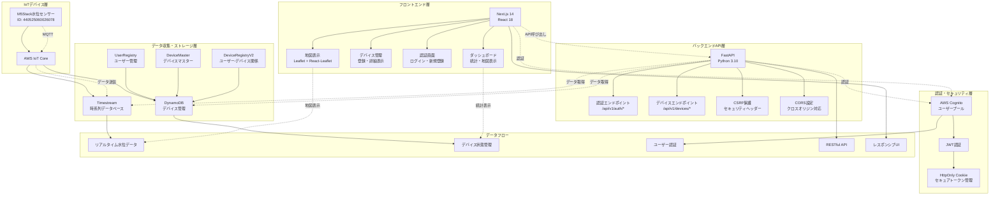

### 将来の拡張構成（Phase 2-4）

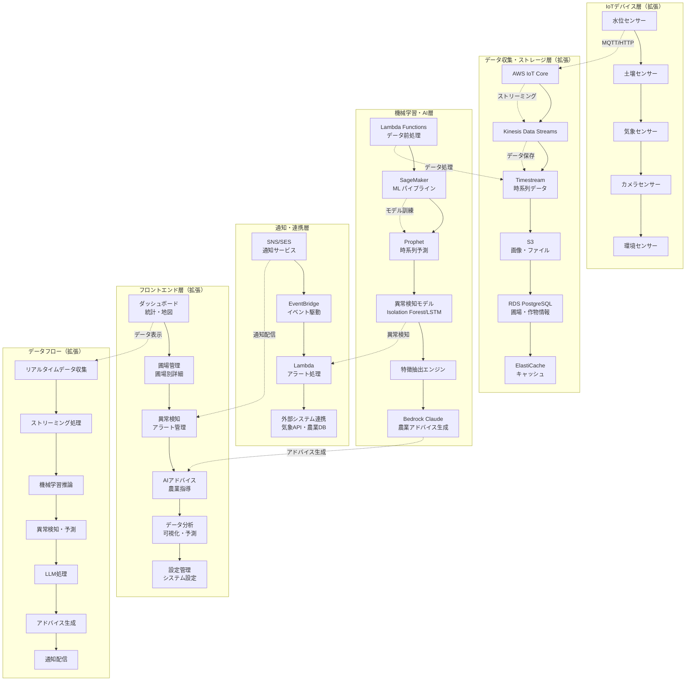

## 🔧 技術スタック詳細

### 現在の技術構成

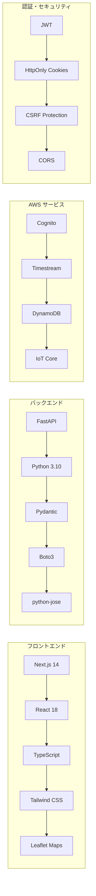

### 将来の技術構成

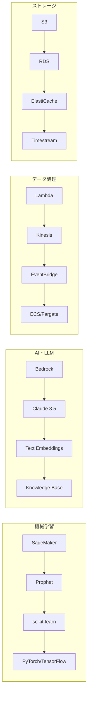

## 📊 データフロー図

### 現在のデータフロー

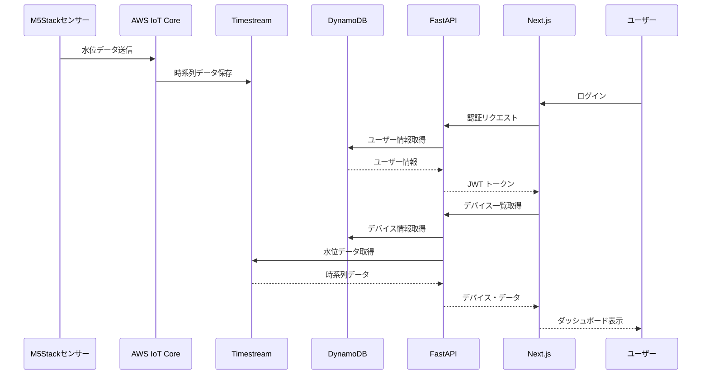

### 将来のデータフロー（異常検知・アドバイス）

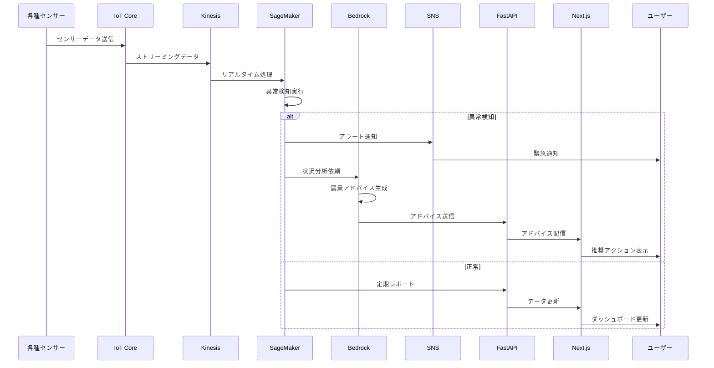

## 🗄️ データベース設計

### 現在のテーブル構成

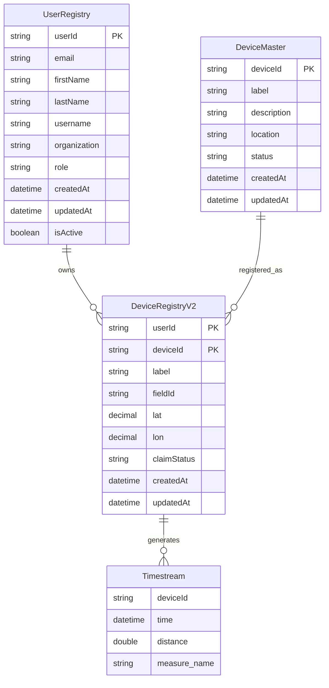

### 将来のテーブル構成

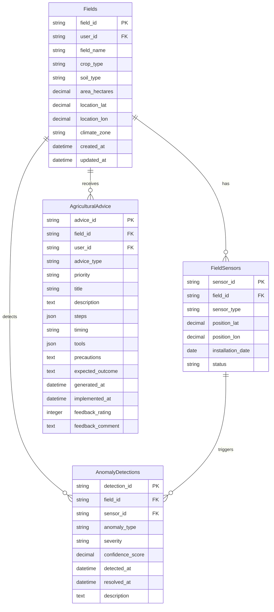

## 🔐 セキュリティアーキテクチャ

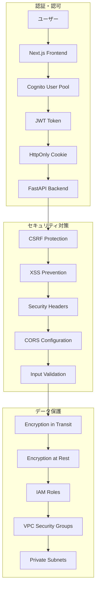

## 📈 スケーラビリティ設計

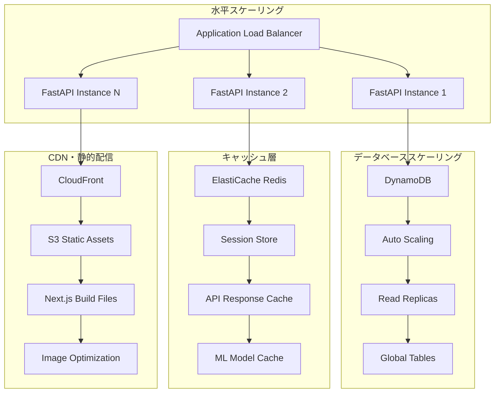

## 🚀 デプロイメント・運用

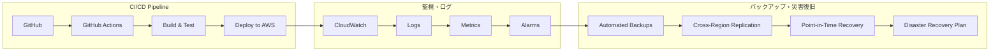

## 📊 パフォーマンス指標

### 現在の目標値

| 指標 | 目標値 | 測定方法 |
|------|--------|----------|
| API応答時間 | < 200ms | CloudWatch |
| ページ読み込み時間 | < 2秒 | Lighthouse |
| システム稼働率 | > 99.9% | CloudWatch |
| 同時接続数 | 1000+ | Load Testing |

### 将来の目標値

| 指標 | 目標値 | 測定方法 |
|------|--------|----------|
| 異常検知精度 | > 95% | ML Metrics |
| 予測精度 | > 90% | Prophet MAE |
| アドバイス実装率 | > 80% | User Analytics |
| リアルタイム処理遅延 | < 5秒 | End-to-End |

---

このシステム構成図は、現在の実装から将来の拡張までを包括的に示しており、段階的な発展を可能にする設計となっています。
